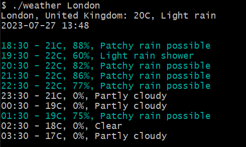

# CLI Weather App - README

## Description

The CLI Weather App is a simple command-line interface application built with Go (Golang) that allows users to get weather information for a specified location. It utilizes the Weather API to fetch weather data and presents it in a user-friendly manner on the terminal.

## Features

- Get current weather information for a specific location.

## Prerequisites

Before running the CLI Weather App, you need to have the following:

- Go (Golang) installed on your system.
- An API key from OpenWeatherMap. You can sign up for a free API key at [Weather API](https://www.weatherapi.com/).

## Installation

1. Clone this repository to your local machine:

```
git clone https://github.com/Ansh-Kushwaha/weather.git
cd weather
```

2. Create a file named `.env` in the root of the project and add your OpenWeatherMap API key as follows:

```
API_KEY=YOUR_WEATHER_API_KEY
```

3. Build the application:

```
go build
```

## Usage

Run the CLI Weather App with the following command:

```
./weather <city_name> 
```

- `<city_name>`: The name of the city for which you want to get weather information (e.g., London, New York, Tokyo, etc.).

Example:

```
./weather London
```


## Acknowledgments

The CLI Weather App was developed with the help of the following resources:

- [Weather API](https://www.weatherapi.com/)
- [Go](https://go.dev/)
- [color](https://github.com/fatih/color) - A Go package to use colors while printing text to console
- [viper](https://github.com/spf13/viper) - Go configuration management with support for 12-factor applications.

## Contributing

Contributions to this project are welcome. If you find any bugs or have additional features to suggest, please open an issue or submit a pull request.

---

Thank you for using the CLI Weather App!
